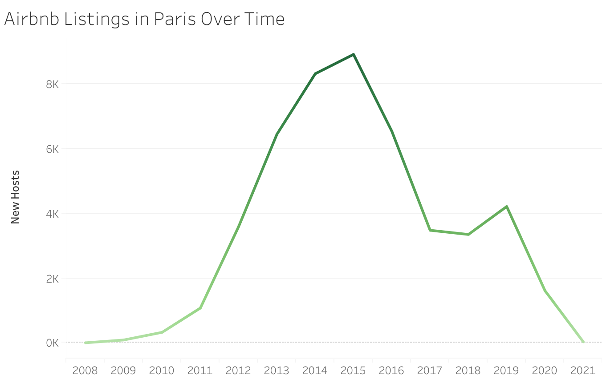
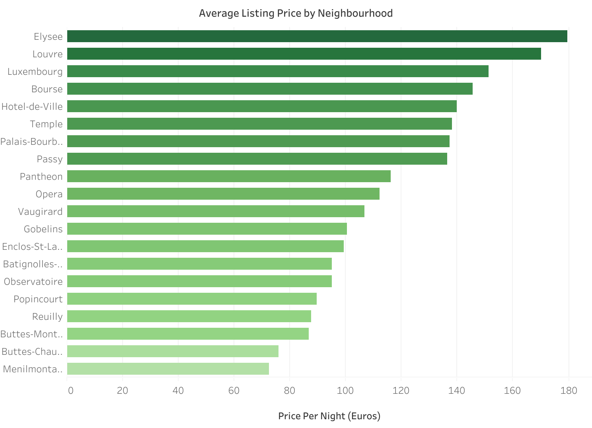

# Parisian Airbnb Eclairs

Airbnb has become a popular platform for short-term vacation rentals, it is like an alternative to traditional hotels. Airbnb offers a unique way to experience new destinations, live like a local, and enjoy a more personalized travel experience.

Req: Python 3.8 | Jupyter notebook | Tableau

# Scenario

Airbnb has Designated a New Performance Analyst, a platform that allows individuals to rent out their homes for travellers.

As AirBnB's popularity has surged, it has become the focus of regulations that limits the number of properties listed in each city.

The New Performance Analyst has been tasked to analyze Paris listings, with a focus on pricing. Management seeks graphical overview of factors influencing pricing and whether the regulations implemented in 2015 impacted the listings in the Paris.

# Objective

The Goal is to figure out:

- Is there any chance the Regulations Implemented in 2015 impacted the listings in Paris?
- The number of Accommodations (Guests the Listing can accommodate) have an effect on Price
- The most expensive Neighbourhood
- Whether certain property types receive consistently higher review scores if so what are these property types.

# WorkFlow

      +-------------------------+
      |          Start          |
      +-------------------------+
                |
                v
      +-------------------------+
      | Data Cleaning           |
      | Tools: Python, Pandas   |
      +-------------------------+
      | - Load Data             |
      | - Handle Missing Values |
      | - Correct Data Types    |
      | - Remove Duplicates     |
      | - Normalize Data        |
      +-------------------------+
                |
                v
      +-------------------------+
      | Data Manipulations      |
      | Tools: SQL, PostgreSQL  |
      +-------------------------+
      | - Connect to Database   |
      | - Data Transformations  |
      | - Aggregate Data        |
      | - Filter and Sort Data  |
      +-------------------------+
                |
                v
      +-------------------------+
      | Data Visualizations     |
      | Tools: Tableau          |
      +-------------------------+
      | - Connect to Data Source|
      | - Create Charts/Graphs  |
      | - Build Dashboards      |
      | - Share/Publish         |
      +-------------------------+
                |
                v
      +-------------------------+
      |           End           |
      +-------------------------+

# Data Exploration

Data Source : https://app.mavenanalytics.io/datasets?search=airbnb

The dataset has a multiple table structure with "279712 rows × 33 columns" since the dataset is about 150+mb it is not available in this github repo, available at https://app.mavenanalytics.io/datasets?search=airbnb  our main work evolves around file Listings.csv and Listings_data_dictionary.csv.

The Relevant Information required to perform the task include:

# Data Cleaning and Preparation

For this Project i've used Python with jupyter notebook to:

- Cast any date columns from the dataframe to the datetime type/format.
- Filter the dataframe down to relevant columns such as‘host_since’, 'name', ‘neighbourhood’, ‘city’, ‘accommodates’, ‘price’, 'review_scores_ratings' and 'property_type'.
- Check for missing values, and calculate the minimum, maximum, and average for each numeric field
- Get rid off all the NA/NAN/Null/missing values.
- Write a new CSV file with Paris-filtered data and all the neat modifications to further utilized for Visualizations in Tableau.

##### - Check Out 'paris_analysis.ipynb'

# Analytical Tasks Performed

###  Is there any chance the Regulations Implemented in 2015 impacted the listings in Paris?

- #### It is most likely the case that the property regulations implemented in 2015 impacted the listings in Paris. Airbnb Listings Over Time:

- #### As it is visible in graph the trend line appears to have steady drop from 2015 and ever since that we can say that paris have become a victim of these regulations when comes to airbnb rentings.

- #### More over since it is a significant drop its important to quantify the analysis, so its worth noting down the actual numbers.

- #### --> Percentage Decrease = (( Number of Listings Pre-Regulation - Number of Listings Post-Regulations ) / Number of Listings Post-Regulation ) × 100

- #### --> Percentage Decrease = (( 8911 - 6538 ) / 8911) * 100
- #### --> Percentage Decrease = 27

- #### A Conclusion can be drawn that results in a 27% decrease in available listings post-regulations in paris.

### Does the number of Accomodations (Guests the Listing can accomodate) have an effect on Price?
- #### Obseerved Analysis Points to the fact that number of accommodations have much effect on pricing. Average Price by Accommodations:

- #### There is drastic change in pricing from the accomodation capacity 10-14.
- #### --> Percentage Increase = (( Average Price (More than 10 Guests) − Average Price (Up to 10 Guests) ) / Average Price Upto 10 Guests ) x 100
- #### --> Percentage Increase = (( 777.4 - 500.9 )/ 500.9) x 100
- #### --> Percentage Increase = 55

- #### The Properties accommodating more than 10 guests demand a 55% higher price on average.

### What are the most Expensive Neighbourhoods in paris?
- #### From the listings 'Elysee' has turned out to be the most expensive neighbourhood in paris.

### Whether certain property types receive consistently higher review scores if so what are these property types?
- #### There are indeed certain property types that have consistent good review ratings. Property type and Corresponding Review Ratings:

# Charts Used For Visualization

- Bar Charts
- Line Charts
- Dual Axis Chart
- Tree Map Chart

# Analytical Results

### Breif overview:

- It is likely the property regulations implemented in 2015 impacted the listings in Paris.
- Its appears that higher the number of Accomodations higher effect on Price.
- 'Elysee' is the expensive neighbourhood in paris.
- Its Observed that Property types with bigger homes tend to get consistenly higher rating score.

