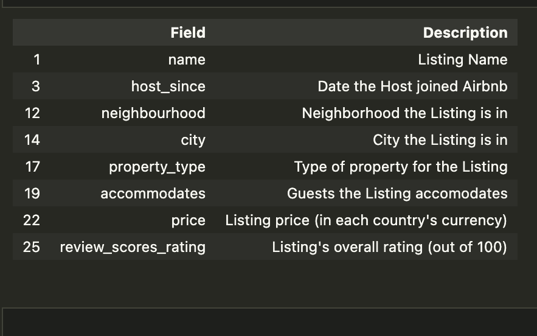
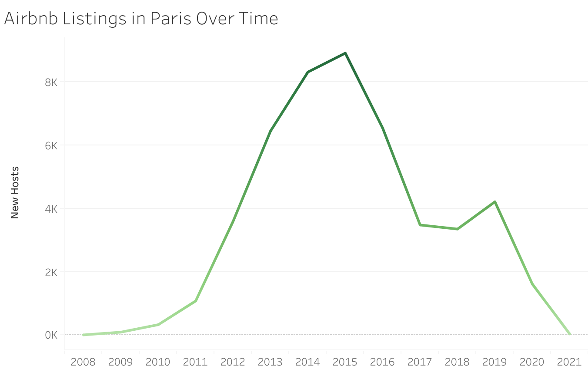
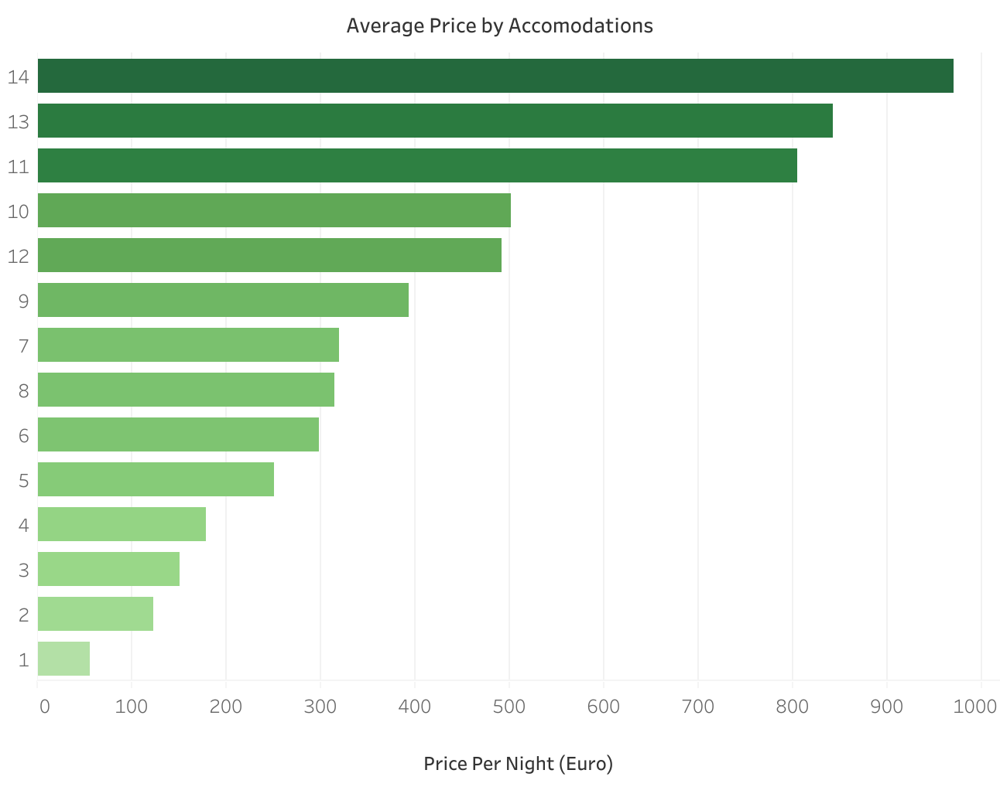
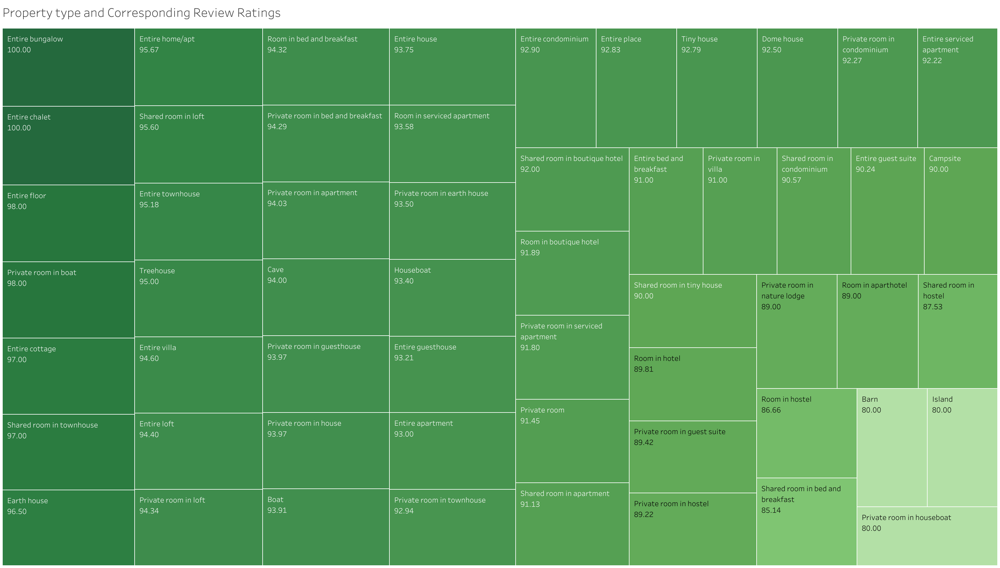
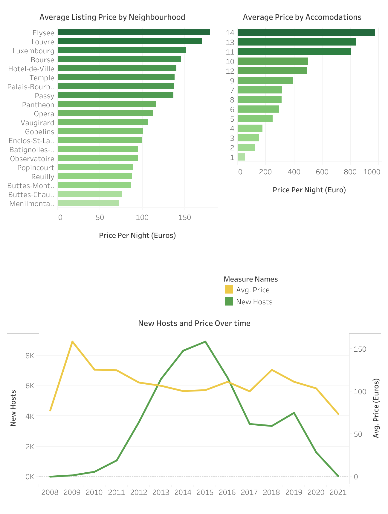

# Parisian Airbnb Eclairs

#### Airbnb has become a popular platform for short-term vacation rentals, providing an alternative to traditional hotels. Airbnb offers a unique way to experience new destinations, live like a local, and enjoy a more personalized travel experience.

# Scenario

You're Designated as New Performance Analyst for AirBnB, a platform that allows individuals to rent out their homes for travellers.

As AirBnB's popularity has surged, it has increasingly become the focus of regulations aimed to limit the number of properties listed in each city.

You've been tasked to analyze Paris listings, with a focus on pricing. Management seeks graphical overview of factors influencing pricing and whether the regulations implemented in 2015 impacted listings in the Paris.

# Objectiv3

The Goal is to figure out:

- Is there any chance the Regulations Implemented in 2015 impacted the listings in Paris?
- The number of Accommodations (Guests the Listing can accommodate) have an effect on Price
- The most expensive Neighbourhood
- Whether certain property types receive consistently higher review scores if so what are these property types.

# Data Exploration

The dataset has a multiple table structure with "279712 rows × 33 columns" our main work evolves around listings.csv, this dataset is available in the paris_data folder.

The Relevant Information required to performed the task include:

# Data Cleaning and Preparation

For this Project i've used Python with jupyter notebook to:

- Cast any date columns from the dataframe to the datetime type/format.
- Filter the dataframe down to relevant columns such as‘host_since’, 'name', ‘neighbourhood’, ‘city’, ‘accommodates’, ‘price’, 'review_scores_ratings' and 'property_type'.
- Check for missing values, and calculate the minimum, maximum, and average for each numeric field
- Get rid off all the NA/NAN/Null/missing values.
- Write a new CSV file with Paris-filtered data and all the neat modifications to further utilized for Visualizations in Tableau.

# Analytical Tasks Performed

- Is there any chance the Regulations Implemented in 2015 impacted the listings in Paris?
  It is most likely the case that the property regulations implemented in 2015 impacted the listings in Paris.
  Airbnb Listings Over Time:

  
- Does the number of Accomodations (Guests the Listing can accomodate) have an effect on Price?
  Obseerved Analysis Points to the fact that number of accommodations have much effect on pricing.
  Average Price by Accommodations:

- The most Expensive Neighbourhood
  From the listings 'Elysee' has turned out to be the most expensive neighbourhood in paris.

- Whether certain property types receive consistently higher review scores if so what are these property types
  There are indeed certain property types that have consistently good review ratings.
  Property type and Corresponding Review Ratings:

# Charts Used For Visualization

- Bar Charts
- Line Charts
- Dual Axis Chart
- Tree Map Chart

# Analytical Results

### Breif overview:

- It is likely the property regulations implemented in 2015 impacted the listings in Paris.
- Its appears that the number of Accomodations indeed have an effect on Price
- 'Elysee' is the expensive neighbourhood in paris
- Its Observed that Property types with bigger homes tend to get consistenly higher rating score.

